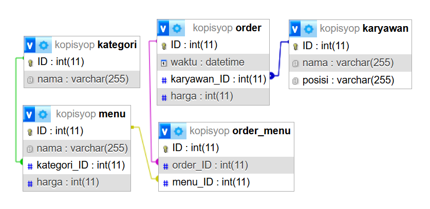

# Janji
_Saya Datuk Daneswara Raditya Samsura dengan NIM 2308224 mengerjakan Tugas Praktikum 7 pada Mata Kuliah Desain dan Pemrograman Berorientasi Objek (DPBO) untuk keberkahan-Nya maka saya tidak melakukan kecurangan seperti yang telah dispesifikasikan. Aamiin_

# Deskripsi & Desain Program

Program terdiri dari __3__ class, yaitu `Karyawan.php`, `Menu.php`, dan `Order.php` yang masing masing memiliki struktur sebagai berikut:
```plaintext
Kopisyop
├── Karyawan.php
│   ├── addKaryawan([nama], [posisi])
│   ├── getAllKaryawan()
│   ├── getKaryawanByID([ID])
│   ├── updateKaryawan([ID], [nama], [posisi])
│   ├── deleteKaryawan([ID])
│   └── searchKaryawan([query])
├── Menu.php
│   ├── addMenu([nama], [kategori_ID], [harga])
│   ├── getAllMenu()
│   ├── getMenuByID([ID])
│   ├── getAllKategori()
│   ├── updateMenu([ID], [nama], [kategori_ID], [harga])
│   ├── deleteMenu([ID])
│   └── searchMenu([query])
└── Order.php
    ├── addOrder([menu_IDs], [karyawan_ID], [harga])
    ├── getAllOrder()
    ├── getOrderByID([ID])
    ├── getAllMenuOrder([ID])
    ├── updateOrder([ID], [karyawan_ID], [menu_IDs], [harga])
    ├── deleteOrder([ID])
    └── searchOrder([query])
```

Program juga terdiri dari __5__ tabel relasional pada [kopisyop.sql](Program/kopisyop.sql) dengan ER-D sebagai berikut:
 

# Dokumentasi